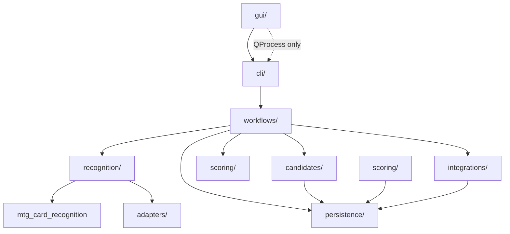

# ADR 0002 — EbayWorkflows package restructure (post v0.3.2)

**Status:** Accepted (expert panel 5/5 APPROVE WITH AMENDMENTS)  
**Date:** 2026-06-10  
**Context:** mtg-card-recognition v0.3.2 removed workflow integration (`ebay_compat`, in-library evidence row policy). EbayWorkflows must own ORM glue, candidate policy, and phase orchestration with clear SRP boundaries.

**Supersedes:** informal `services/` layout described in pre-2026-06 `implementation-spec.md`  
**Review record:** `docs/expert-panel/reviews/ebay-restructure-v1.md`

## Decision

Adopt a **layered package layout** with a single library import boundary (`recognition/`), extracted **candidate row policy** (`candidates/`), thin **workflow** executors (`workflows/`), and incremental **persistence** repositories — migrated in milestones **M1–M7** with re-export shims (no big-bang rename).

## Target dependency rules

| From | May import |
|------|------------|
| `gui/` | `workflows/catalog`, `persistence` DTOs, `operations` — **not** `recognition/`, **not** `mtg_card_recognition` |
| `workflows/` | `recognition`, `candidates`, `scoring`, `integrations`, `persistence` — **not** `mtg_card_recognition` directly |
| `recognition/`, `adapters/` | `mtg_card_recognition` only |
| `integrations/` | HTTP clients, DTOs — **not** ORM in client code |
| `candidates/` | `persistence`, `adapters`, `recognition` types — **not** phase executors |

## Migration milestones

| Milestone | Deliverable |
|-----------|-------------|
| **M1** | Docs sync; complete `RecognitionSettings` adapter; import-boundary test; collapse Phase 5 dual attach | **[Shipped]** |
| **M2** | Move `image_analysis` → `recognition/phase5_analysis.py`; ban direct lib imports elsewhere | **[Shipped]** |
| **M3** | `candidates/` package; re-export from `services/candidate_*` | **[Shipped]** |
| **M4** | `workflows/` thin wrappers; shared `workflows/catalog.py` for CLI + GUI | **[Shipped]** |
| **M5** | Split `scoring/`, `operations/` from `services/` | **[Shipped]** |
| **M6** | Incremental repositories (`CandidateRepository`, `ListingRepository`); Alembic via `persistence.models` | **[Shipped]** |
| **M7** | Remove `services/` shims; canonical import paths | **[Shipped]** |

## Trust invariants (unchanged)

- Tier 8 cascade gate in library is authoritative for proposal `gate_status`
- Consumer `candidate_gate` is idempotent re-check on persisted rows
- Do **not** move row verification policy back into mtg-card-recognition
- Single writer discipline on `evidence_json` updates (sync → gate → selection)

## Consequences

**Positive:** Aligns with library SRP; reduces coupling when cascade types evolve; GUI/CLI share one workflow catalog.

**Negative:** ~~Temporary duplication via `services/` shims during M1–M6~~ resolved in M7; import-boundary CI remains required.

## Related

- [`mtg-card-recognition/docs/integration/ebay-workflows.md`](../../mtg-card-recognition/docs/integration/ebay-workflows.md)
- `docs/architecture.md`
- `docs/card-recognition-architecture.md`
