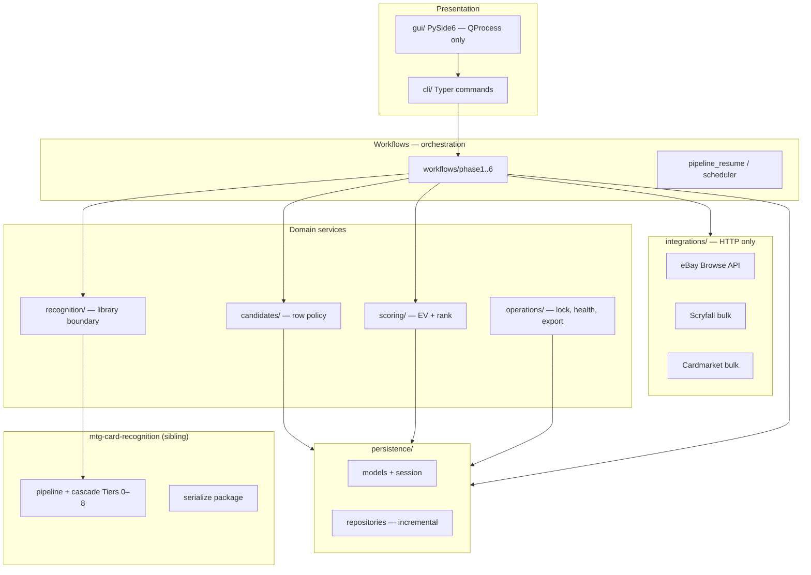
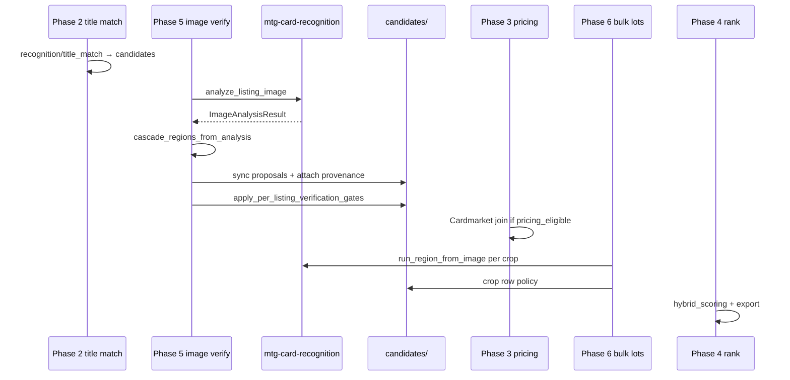

# System Architecture

**Status:** **[Shipped]** current behavior; package layout is the **shipped ADR 0002 layout** (see `adr/0002-package-restructure.md`, `expert-panel/reviews/ebay-restructure-v1.md`). Tags: `documentation-status.md`.

## High-Level Architecture

EbayWorkflows is a **local workflow application**: CLI + optional PySide6 GUI, PostgreSQL backing store, and phase-oriented workers. Image recognition runs in the sibling **`mtg-card-recognition`** library; this repo owns ingest, persistence, candidate row policy, scoring, and operator UX.



## Responsibility split (v0.3.2)

| Question | Owner |
|----------|--------|
| What card is in this crop? | **mtg-card-recognition** — zones, OCR, cascade, Tier 8 gate |
| What gets stored on `listing_card_candidates`? | **EbayWorkflows** — `candidates/` attach, sync, gate, selection |
| Which listings to ingest and rank? | **EbayWorkflows** — phases, scoring, integrations |
| Operator UI and scheduling? | **EbayWorkflows** — `gui/`, `scheduler` |

The library **does not** know Postgres, eBay, Cardmarket, or `evidence_json` shape. New library features use native cascade types (`ImageAnalysisResult`, `Proposal`) — not legacy `RegionAnalysis` shims.

## Core components

1. **CLI** — command parsing, run records, dispatches phase executors (`cli/`)
2. **Workflow engine** — phase graph **2 → 5 → 3 → 6 → 4**, checkpoints, resume (`workflows/phase*.py`)
3. **Integrations** — eBay, Scryfall, Cardmarket HTTP clients; return DTOs only (`integrations/`)
4. **Recognition bridge** — sole importer of `mtg_card_recognition` (`recognition/`)
5. **Candidate policy** — persist cascade output, verification on rows, one winner per listing (`candidates/`)
6. **Scoring** — EV, hybrid rank, guardrails (`scoring/`)
7. **Persistence** — SQLAlchemy models, session, repositories (`persistence/`; `models.py` + `db.py` root shims)
8. **Desktop GUI** — PySide6; **must not** import torch/OCR/library; phases run in child CLI processes (`gui/`)

## Module layout

```text
src/ebay_workflows/
├── core/                 # config, logging, exceptions  [Future split]
├── adapters/             # Settings ↔ RecognitionSettings
├── integrations/         # eBay, Scryfall, Cardmarket — HTTP → DTOs
├── recognition/          # ONLY mtg_card_recognition imports
│   ├── catalog_index.py  # ORM Scryfall → CatalogIndex
│   ├── cascade_persist.py
│   ├── phase5_analysis.py
│   └── title_match.py    # Phase 2 — not image cascade
├── candidates/           # row policy (gate, sync, selection)
├── scoring/              # EV, hybrid rank, guardrails
├── workflows/            # thin phase executors + catalog
├── operations/           # lock, health, progress, export, sample scope
├── persistence/          # session, models re-export, repositories
├── cli/
└── gui/                  # presenters; no library imports
```

**Import rule (P0):** only `recognition/` and `adapters/` may `import mtg_card_recognition`. Enforced by CI (`test_import_boundaries.py`) — see `adr/0002-package-restructure.md`.

## Persistence layer

| Piece | Location | Notes |
|-------|----------|-------|
| ORM models | `models.py` (canonical); `persistence/models.py` re-export | Alembic `target_metadata` |
| Session factory | `persistence/session.py`; `db.py` shim | Pool from `Settings.database_url` |
| Repositories | `persistence/repositories/` | `CandidateRepository`, `ListingRepository` — incremental adoption (Phase 5 first) |
| Migrations | `alembic/versions/` | Baseline `0001`, `0002`; run via `alembic upgrade head` after `init-db` |
| Performance indexes | `operations/db_indexes.py` | `ensure-db-indexes` CLI supplement |

Root `models.py` and `db.py` remain entrypoints for backward compatibility; new code should import from `persistence/` where practical.

## Workflow execution model

- **Run** — one invocation with parameters
- **Step** — one phase within a run
- **Resume** — rerun failed/incomplete steps; Phase 1 resume uses last successful metrics threshold



## CV and matching stack

Detail: `card-recognition-architecture.md`, [`mtg-card-recognition/docs/integration/ebay-workflows.md`](../mtg-card-recognition/docs/integration/ebay-workflows.md).

| Layer | Location | Status |
|-------|----------|--------|
| OpenCV zones, align, crops | mtg-card-recognition | **[Shipped]** |
| Cascade Tiers 0–8 + Tier 8 gate | mtg-card-recognition | **[Shipped]** |
| Evidence serialization | mtg-card-recognition `serialize/` | **[Shipped]** |
| Row verification policy | EbayWorkflows `candidates/` (`candidate_gate`, `candidate_selection`) | **[Shipped]** |
| OpenCLIP + FAISS | library search; consumer index build orchestration | **[Shipped]** |
| Tesseract OCR | library; PaddleOCR **[Future]** |
| Title fuzzy match | EbayWorkflows `recognition/title_match` | **[Shipped]** |

## Phase 6 bulk-lot module names **[Shipped]**

| Module | Role |
|--------|------|
| `recognition/bulk_lot_detection.py` | OpenCV contour multi-card detection (library-backed CV) |
| `recognition/listing_lot_detection.py` | Phase 6 adapter: Settings → `bulk_lot_detection`, payload helpers |
| `recognition/region_crop_match.py` | Per-crop cascade match via library `run_region_from_image` |
| `recognition/lot_crop_match.py` | Phase 6 wrapper: Settings, FAISS hook, title index → `region_crop_match` |
| `workflows/phase6.py` | Executor: `run_phase6_bulk_lot_detection` |
| CLI | `phase6-detect-lots`; flag `--use-real-lot-detection` |

`detection_type=lot_card` in DB distinguishes lot crops from Phase 5 `card_region` rows.

**Historical [Historical]:** in-library `mtg_card_recognition.evidence` gate/attach and `pipeline/ebay_compat.RegionAnalysis` — removed in library v0.3.2.

## Error handling

- classify transient vs permanent failures
- retry integration/network with backoff
- record-level failures do not abort full batch
- redact secrets in logs

## Observability

- structured logs: `run_id`, `step_name`, `listing_id`
- step status + counters in DB
- match event log (`MATCH_EVENT_LOG_PATH`) and ranked export
- Tier 7 metrics — **[Shipped]** in `operations/metrics.py`; Phase 5 emits `tier7_proposals_raw`, `tier7_post_veto`, `tier7_verified` in step metrics

## Security

- credentials from environment only
- least-privilege DB role
- no secrets in source control or logs

## Related docs

- `card-recognition-architecture.md` — library vs consumer boundary, Phase 5 wiring
- `workflow-phases.md` — per-phase acceptance criteria
- `trust-invariants.md` — verification policy summary
- `adr/0002-package-restructure.md` — restructure record (M1–M7 complete)
- `gui-application.md` — GUI subprocess boundary
