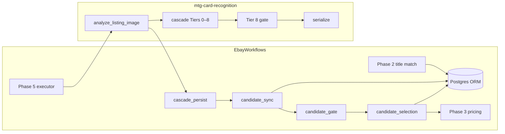
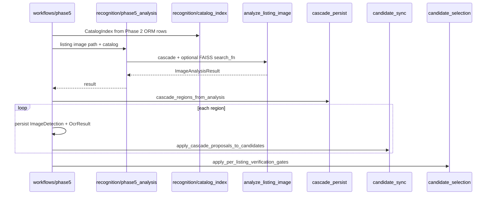

# Card Recognition Architecture

**Status:** **[Shipped]** integration contract with **mtg-card-recognition v0.3.2+**. Consumer package layout: `adr/0002-package-restructure.md`.

## Canonical library docs

- Local: [`../mtg-card-recognition/docs/architecture.md`](../mtg-card-recognition/docs/architecture.md)
- Integration contract: [`../mtg-card-recognition/docs/integration/ebay-workflows.md`](../mtg-card-recognition/docs/integration/ebay-workflows.md)
- Cascade ADR: [`../mtg-card-recognition/docs/adr/0003-proposal-cascade-flow.md`](../mtg-card-recognition/docs/adr/0003-proposal-cascade-flow.md)

## Boundary diagram



**Library answers:** proposals + in-memory `gate_status` per cascade run.  
**Consumer answers:** which rows to update, `image_verified`, `pricing_eligible`, provenance fields.

## What moved out of the library (v0.3.1 → v0.3.2)

| Removed from library | EbayWorkflows home |
|----------------------|-------------------|
| `pipeline/ebay_compat.py` (`RegionAnalysis`) | `recognition/cascade_persist.py` → `CascadeRegionView` |
| `evidence/gate.py`, `selection.py`, `attach.py`, `candidate_sync.py` | **`candidates/`** (`candidate_gate`, `candidate_selection`, `candidate_attach`, `candidate_sync`) |
| Title match, bulk-lot orchestration, set-symbol template build | `recognition/title_match`, `bulk_lot_detection`, `set_symbol_templates` |
| Catalog from ORM rows | `recognition/catalog_index.py` |

**Kept in library:** `mtg_card_recognition.serialize` (`proposal_to_evidence`, `region_evidence_json`, `build_attach_rows`).

## Public library API (consumer imports)

```python
# Config
RecognitionSettings, from_env

# Phase 5
analyze_listing_image          # → ImageAnalysisResult (gate + cascade + region_specs)
run_listing_image_cascade
run_region_from_image
extract_region_cascade
apply_per_listing_gate_winner  # in-memory proposals — not DB rows

# Serialization
build_attach_rows, region_evidence_json

# IR (lazy exports)
search_similar_cards, build_index_from_printings
```

Do **not** import removed modules: `evidence.gate`, `pipeline.ebay_compat`, `analysis.regions`.

## Phase 5 wiring (EbayWorkflows)



### Module map

| Step | Module | Role |
|------|--------|------|
| 1 | `recognition/catalog_index.py` | Scryfall ORM → `CatalogIndex` / `SidecarIndex` |
| 2 | `recognition/phase5_analysis.py` | Wrap `analyze_listing_image` + embedding `search_fn` |
| 3 | `recognition/cascade_persist.py` | `ImageAnalysisResult` → `CascadeRegionView` list |
| 4 | `candidates/candidate_attach.py` | Region-scoped provenance; `candidates_for_region_evidence` |
| 5 | `candidates/candidate_sync.py` | Merge proposals + `zone_evidence` onto rows |
| 6 | `candidates/candidate_selection.py` | `apply_per_listing_verification_gates` — ≤1 winner |
| 7 | `candidates/candidate_gate.py` | Row-level re-check; honors cascade `gate_status` |

Settings: `adapters/recognition_settings.py` → `RecognitionSettings` (complete field map or `from_env()`).

## Verification policy (two layers)

| Layer | Where | Role |
|-------|-------|------|
| **Tier 8 cascade gate** | mtg-card-recognition `cascade/gate.py` | Authoritative on proposals: `gate_status`, `gate_fail_reason` |
| **Row policy** | EbayWorkflows `candidate_gate` + `candidate_selection` | Idempotent check on persisted `evidence_json`; sets `image_verified`, `pricing_eligible` |

Rules (**[Shipped]**):

- **Hard verify:** bottom set + collector **and** (name OCR ≥ `VERIFY_NAME_HARD_MIN` **or** symbol ≥ `VERIFY_SYMBOL_STRONG_MIN`)
- OCR, FAISS, mana **alone never verify**
- At most **one** `image_verified` printing per listing for pricing/EV
- Provenance: `verification_listing_image_id`, `verification_detection_id`, `verification_region_path`

Optional `FAISS_PROPOSE_CANDIDATES=true` inserts `faiss_proposal` candidate — still subject to row gate.

**Historical [Historical]:** OR-gate on any single signal; in-library `evidence/gate.py` auto-pricing via symbol-only path.

## Phase 6 wiring

EbayWorkflows `recognition/bulk_lot_detection.py` + `region_crop_match.py` call library `run_region_from_image` per crop. Same candidate row policy applies via `crop_match_allowed_for_pricing` (`scoring/ev_guardrails`).

## Artifact paths

Under `IMAGE_CACHE_DIR` (typical):

| Path | Purpose |
|------|---------|
| `crops/` | Listing card region crops |
| `crops/zones/` | name, bottom, symbol, mana strips |
| `set_symbol_templates/` | Offline templates (consumer build) |
| `scryfall_art_zones/` | FAISS corpus art-zone cache |
| FAISS index file | `FAISS_INDEX_PATH` meta JSON |

## Rebuild matrix

Rebuild FAISS when **any** of these change: `FAISS_INDEX_USE_ART_ZONE`, `OPENCLIP_MODEL_NAME`, embedder dimension, crop mode.

Do **not** rebuild for: documentation updates, OCR backend swap (Tesseract ↔ PaddleOCR), threshold tuning via env.

Full build: `./scripts/build-faiss-full.ps1`. Validate: `ebay-workflows validate-env`.

## External scanner references

See `library-stack.md` — CollectorVision/Milo, scryglass, etc. are evaluation references only, not dependencies.

## Regression split

| Suite | Location |
|-------|----------|
| Labeled crop cascade | `mtg-card-recognition/tests/test_labeled_crops_regression.py` |
| Consumer row policy | `EbayWorkflows/tests/test_evidence_gate.py` |
| Cascade persist views | `EbayWorkflows/tests/test_cascade_persist.py` |
| Phase 5 workflow | `EbayWorkflows/tests/test_phase5_matching.py` |

## Related docs

- `integration-specs.md` — API + verification summary
- `workflow-phases.md` — phase order and acceptance criteria
- `data-dictionary.md` — `evidence_json` fields
