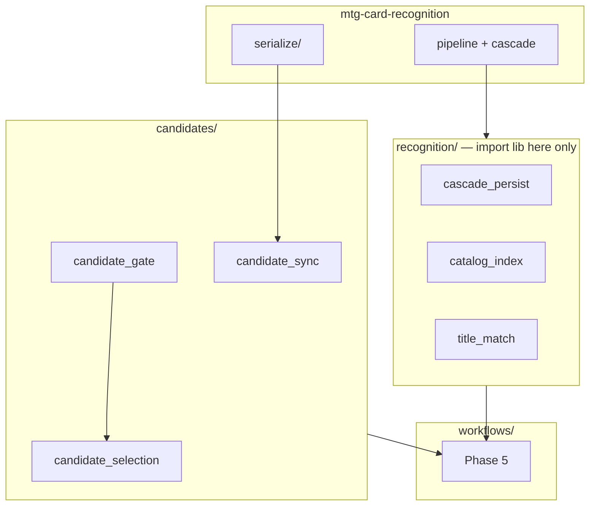

# Documentation Status Labels

Use these tags when reading or editing docs so **shipped code**, **historical behavior**, and **planned work** are not confused.

## Tags

| Tag | Meaning |

|-----|---------|

| **[Shipped]** | Implemented on branch `main`. Describes current production behavior. |

| **[Historical]** | Describes behavior **before** v0.3.2 library split or pre–ADR 0002 layout. Kept for audit — **do not restore**. |

| **[Future]** | Planned or partial — **not final** behavior. |

When a line mixes shipped and planned parts, tag each clause.

## Full document index

| Document | Status | Notes |

|----------|--------|-------|

| `architecture.md` | **[Shipped]** | Layered packages; mermaid boundaries |

| `card-recognition-architecture.md` | **[Shipped]** | Library vs consumer; Phase 5 sequence |

| `trust-invariants.md` | **[Shipped]** | Verification policy summary |

| `contributing-docs.md` | **[Shipped]** | Code change → doc map |

| `adr/0002-package-restructure.md` | **[Shipped]** | M1–M7 complete |

| `expert-panel/reviews/ebay-restructure-v1.md` | **[Shipped]** | Panel 5/5 approve |

| `expert-panel/reviews/documentation-audit-v1.md` | **[Shipped]** | Doc accuracy review; P0 backlog |

| `workflow-phases.md` | **[Shipped]** | Order 2→5→3→6→4 |

| `config-contract.md` | **[Shipped]** | Env vars including `VERIFY_*` |

| `data-dictionary.md` | **[Shipped]** | `evidence_json`; writer = `candidates/` |

| `data-model.md` | **[Shipped]** | Schema; Alembic baseline `0001`/`0002` |

| `ranking-and-confidence.md` | **[Shipped]** | Guardrails in `scoring/` |

| `library-stack.md` | **[Shipped]** | Propose/confirm split; version pin |

| `integration-specs.md` | **[Shipped]** | API + CV policy |

| `implementation-spec.md` | **[Shipped]** | Canonical module layout |

| `runbook-local.md` | **[Shipped]** | Setup, phases, reanalyze |

| `testing-strategy.md` | **[Shipped]** | CI + `test_import_boundaries` |

| `large-scale-ingest.md` | **[Shipped]** | Runbook |

| `future-cv-ocr.md` | **[Future]** | PaddleOCR, Milo, labeled crops roadmap |
| `future-pain-points.md` | Mixed | Per-section tags |

| `development-roadmap.md` | **[Shipped]** | Milestones 0–7 + ADR 0002 |

| `product-requirements.md` | **[Shipped]** | Scope + strict verify |

| `error-model.md` | **[Shipped]** | Exit codes |

| `gui-application.md` | **[Shipped]** | QProcess boundary |

| `gui-visual-design.md` | **[Shipped]** | Theme |

| `gui-operator-workflows.md` | **[Shipped]** | Operator flows |

| `gui-build-prerequisites.md` | **[Shipped]** | Checklist |

| `gui-windows-scheduler.md` | **[Shipped]** | Headless schedules |

| `adr/0001-tech-stack.md` | **[Shipped]** | Stack |

| `README.md` (this folder) | **[Shipped]** | Doc map |

| [`mtg-card-recognition`](../mtg-card-recognition) | Shipped | Sibling repo v0.3.2+ |

| `open-items-status.md` | **[Shipped]** | Backlog |

| `post-workflow-checklist.md` | **[Shipped]** | After pipeline run |

## Intentionally not final

- PaddleOCR, Milo eval, full labeled-crop PNG regression in CI (see `future-cv-ocr.md`)

- Tier 7 metrics emission (`operations/metrics`)

Last full doc sync: **2026-06-10** (documentation audit P0–P1; ADR 0002 M1–M7).

## Code map (for doc authors)

See also `contributing-docs.md`.

| Concern | Location |

|---------|----------|

| Recognition library | Sibling `../mtg-card-recognition` v0.3.2+ |

| Library import boundary | `recognition/`, `adapters/recognition_settings.py` |

| Cascade → DB views | `recognition/cascade_persist.py` |

| Row verification policy | `candidates/` |

| Tier 8 gate (proposals) | Library `cascade/gate.py` — not consumer |

| Phase executors | `workflows/phase*.py` |

| eBay / Scryfall / CM HTTP | `integrations/` |

| EV / rank | `scoring/` |

| GUI (no library) | `gui/` — `QProcess` → CLI |

| Export provenance | `operations/ranked_export.py` |

| DB session / repos | `persistence/session.py`, `persistence/repositories/` |

| Alembic | `alembic/` → `persistence.models.Base` |

**Historical [Historical]:** `mtg_card_recognition.evidence` gate/attach in library; `RegionAnalysis` / `ebay_compat`; root `workflow_phase*.py` and `services/` package (removed M7).

