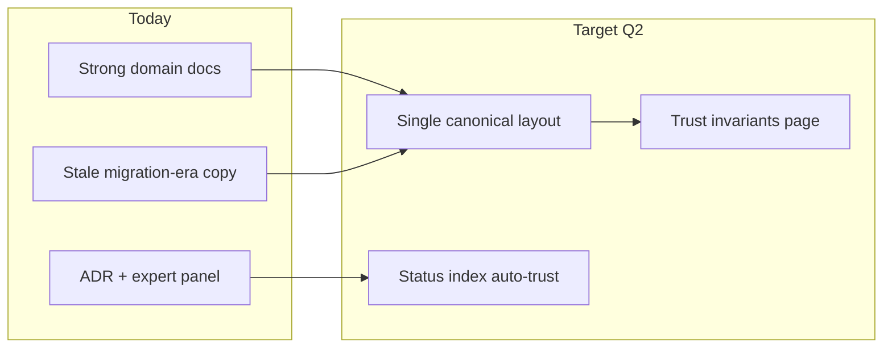

# Expert panel — Documentation audit v1

**Date:** 2026-06-10  
**Topic:** Post–ADR 0002 (M1–M7 complete) documentation accuracy, navigation, and improvement outlook  
**Outcome:** **5/5 APPROVE WITH AMENDMENTS** — docs are usable but **~15 files contain stale layout references**; prioritize a **P0 scrub pass** before adding new features  
**Process:** [`process.md`](../process.md) · Majority rule for doc structure; unanimous for verification/trust invariants

## Scope

48 markdown files under `docs/`, cross-checked against shipped code (`workflows/`, `candidates/`, `scoring/`, `operations/`, `persistence/`, no `services/` package). Panel asked: *Is documentation trustworthy for a new contributor or operator today? What should improve next?*

---

## Expert 1 — Information architecture & technical writing

**Specialty:** Doc map, tagging, discoverability, tone consistency

### Assessment

**Strengths**

- `documentation-status.md` is an excellent pattern — **[Shipped] / [Historical] / [Future]** tags reduce confusion when migration was in flight.
- `docs/README.md` document map covers most domains (architecture, phases, GUI, runbook, ADRs).
- Expert panel + ADR pattern gives audit trail for major decisions.

**Gaps**

| Issue | Severity | Example |
|-------|----------|---------|
| **Dual “current vs target” narratives** | P0 | `implementation-spec.md` still has “Current (shipped)” showing `services/` and `workflow_phase*.py` while code has neither |
| **Index drift** | P1 | `documentation-status.md` rows still tag import-boundary tests and Alembic as **[Future] M1/M6** though both exist |
| **Future tense intro** | P2 | `docs/README.md` opens with “This repository **will host**…” — reads pre-MVP |
| **No contributor routing doc** | P1 | No single “I changed X → edit doc Y” table beyond partial code map in `documentation-status.md` |
| **Broken relative links risk** | P2 | README lists `docs/adr/0001` inside `docs/` folder (duplicate `docs/` prefix) |

### Vote

**APPROVE WITH AMENDMENTS** — Collapse to **one canonical module tree** in `implementation-spec.md` and refresh the status index after every milestone.

### Recommended actions (E1)

| ID | Action |
|----|--------|
| E1-1 | Rewrite `implementation-spec.md` § Module layout — single tree matching `architecture.md`; move old layout to **[Historical]** appendix |
| E1-2 | Refresh `documentation-status.md` index rows (remove M1–M7 **[Future]** notes; mark Alembic baseline **[Shipped]**) |
| E1-3 | Update `docs/README.md` to present tense; add `persistence/`, `operations/`, expert panel doc-audit link |
| E1-4 | Add **Contributor doc map** subsection (or `docs/contributing-docs.md`): code path → owning doc |

---

## Expert 2 — Application architecture alignment

**Specialty:** Code ↔ doc parity, package boundaries, diagrams

### Assessment

**Strengths**

- `architecture.md` module tree (post–June 10 edit) matches shipped packages.
- `adr/0002-package-restructure.md` milestones correctly marked **[Shipped]**.
- `test_import_boundaries.py` gives enforceable truth for library import rules.

**Gaps**

| Issue | Severity | Location |
|-------|----------|----------|
| **Stale mermaid labels** | P0 | `architecture.md` high-level diagram: `workflow_phase1..6 / workflows/` |
| **“Today → target” arrows** | P0 | `implementation-spec.md` mermaid `now → target` — migration is done |
| **Missing persistence layer in specs** | P1 | `CandidateRepository` / `ListingRepository` only in code + one test; not in architecture narrative |
| **GUI doc stale paths** | P1 | `gui-application.md` cites `workflow_phase*.py` and `services/` |
| **Phase doc footnotes** | P2 | `workflow-phases.md` line “today `services/image_analysis`” |

### Vote

**APPROVE WITH AMENDMENTS** — Architecture docs are **80% aligned**; remaining 20% is concentrated in `implementation-spec.md` and diagram labels.

### Recommended actions (E2)

| ID | Action |
|----|--------|
| E2-1 | Global grep scrub: `services/`, `workflow_phase`, `TEMP shim`, `today \` in `docs/` |
| E2-2 | Add `persistence/` section to `architecture.md`: session, models re-export, repositories, Alembic entrypoint |
| E2-3 | Update all mermaid participants to `workflows/phase5` not `workflow_phase5` |
| E2-4 | Document **canonical import paths** table (old shim → new module) in `implementation-spec.md` **[Historical]** one-liner only |

---

## Expert 3 — Operator onboarding & runbooks

**Specialty:** Local setup, GUI operator flows, operational snapshots

### Assessment

**Strengths**

- `runbook-local.md`, `post-workflow-checklist.md`, and GUI trilogy (`gui-application`, `gui-operator-workflows`, `gui-build-prerequisites`) are detailed and operator-focused.
- `large-scale-ingest.md` addresses production-scale concerns.
- Sample iteration scripts documented indirectly via testing strategy smoke tiers.

**Gaps**

| Issue | Severity | Notes |
|-------|----------|-------|
| **Stale operational snapshot dominates open-items** | P1 | `open-items-status.md` leads with 2026-06-09 Phase 5 failure — fixed in code since; reads like active incident |
| **Package rename not reflected in operator paths** | P2 | Runbooks don’t mention import paths, but CLI commands unchanged — low operator impact |
| **No “after M7” smoke path** | P2 | Post-restructure validation (`pytest`, `run_sample_iterations`) not in post-workflow checklist |
| **GUI doc import warning** | P2 | Still says don’t import `workflow_phase5` — should say `workflows.phase5` for contributors |

### Vote

**APPROVE** — Operator docs remain **fit for purpose**; backlog doc needs temporal hygiene.

### Recommended actions (E3)

| ID | Action |
|----|--------|
| E3-1 | Move 2026-06-09 reanalyze block in `open-items-status.md` under **[Historical] snapshot**; lead with current P1–P4 table |
| E3-2 | Add post–ADR 0002 checklist item to `post-workflow-checklist.md`: `pytest -q`, import-boundary tests, optional 5-listing sample run |
| E3-3 | Refresh `gui-application.md` § architecture boundary (remove `services/` mention) |

---

## Expert 4 — Verification, testing & data semantics

**Specialty:** Testing strategy, data dictionary, ranking/guardrails docs

### Assessment

**Strengths**

- `testing-strategy.md` lists real test modules (`test_evidence_gate`, `test_cascade_persist`, `test_import_boundaries`).
- `data-dictionary.md` correctly assigns `evidence_json` writer to `candidates/`.
- `ranking-and-confidence.md` aligns with `scoring/` guardrails.

**Gaps**

| Issue | Severity | Notes |
|-------|----------|-------|
| **Status index contradicts body** | P1 | `documentation-status.md` says import tests **[Future] M1**; `testing-strategy.md` body says **[Shipped]** |
| **Alembic understated** | P1 | `data-model.md` says Alembic **[Future]**; repo has `alembic/versions/0001`, `0002` + `persistence.models` in `env.py` |
| **Repository tests undocumented** | P2 | `test_repositories.py` added but not in testing-strategy table until recent partial update |
| **No doc for strict gate invariants** | P2 | Trust rules scattered across `card-recognition-architecture`, `ranking-and-confidence`, ADR 0002 — no single “invariants” page |

### Vote

**APPROVE WITH AMENDMENTS** — Test docs are strong; **data-model Alembic status** and **status index** must sync.

### Recommended actions (E4)

| ID | Action |
|----|--------|
| E4-1 | Update `data-model.md` header: Alembic baseline **[Shipped]**; `ensure-db-indexes` as supplement |
| E4-2 | Add `test_repositories.py` to testing-strategy verification table (if not already) |
| E4-3 | Consider `docs/trust-invariants.md` (short): Tier 8 authority, consumer gate idempotency, single writer on `evidence_json`, pricing-eligible sources |
| E4-4 | Single source of truth: `documentation-status.md` generated or checklist-reviewed after each milestone |

---

## Expert 5 — Cross-repo integration & library boundary

**Specialty:** mtg-card-recognition sibling, integration-specs, library-stack

### Assessment

**Strengths**

- `card-recognition-architecture.md` is the best integration doc — boundary diagram, v0.3.2 removal table, public API snippet.
- `library-stack.md` correctly describes propose/confirm split with `candidates/`.
- Links to sibling `integration/ebay-workflows.md` are present.

**Gaps**

| Issue | Severity | Notes |
|-------|----------|-------|
| **Migration table still lists services paths** | P1 | `card-recognition-architecture.md` row: `services/candidate_*` → should read `candidates/` only |
| **integration-specs mermaid** | P1 | `candidates/ — services/candidate_* today` |
| **future-pain-points path** | P2 | Still cites `services/currency.py` → `scoring/currency.py` |
| **No version pin doc** | P2 | Dev install pin (`pyproject.toml` commit) not documented in `library-stack` or runbook |
| **Sequence diagram naming** | P2 | Participant `workflow_phase5` → `workflows/phase5` |

### Vote

**APPROVE WITH AMENDMENTS** — Integration story is **conceptually correct**; path strings lag restructure by one pass.

### Recommended actions (E5)

| ID | Action |
|----|--------|
| E5-1 | Update migration tables in `card-recognition-architecture.md` and `integration-specs.md` to final package names |
| E5-2 | Add **Library version pin** subsection to `library-stack.md` or `runbook-local.md` (`install-dev.ps1`, git SHA) |
| E5-3 | Cross-link `documentation-audit-v1` from `expert-panel/process.md` |

---

## Phase C — Final votes

| Agent | Specialty | Vote |
|-------|-----------|------|
| 1 | Information architecture | APPROVE WITH AMENDMENTS |
| 2 | Application architecture | APPROVE WITH AMENDMENTS |
| 3 | Operator / runbooks | APPROVE |
| 4 | Verification & data | APPROVE WITH AMENDMENTS |
| 5 | Cross-repo integration | APPROVE WITH AMENDMENTS |

**Result: 5/5 APPROVE WITH AMENDMENTS**

---

## Consolidated priority backlog (adopted)

### P0 — Trust repair ✅ Applied 2026-06-10

| ID | Status |
|----|--------|
| P0-1 `implementation-spec.md` canonical layout | ✅ |
| P0-2 Grep scrub `services/`, `workflow_phase` in user-facing docs | ✅ |
| P0-3 `documentation-status.md` index sync | ✅ |

### P1 — Completeness ✅ Applied 2026-06-10

| ID | Status |
|----|--------|
| P1-1 `architecture.md` + `data-model.md` persistence | ✅ |
| P1-2 `open-items-status.md` historical snapshot | ✅ |
| P1-3 Path updates in GUI, integration, card-recognition docs | ✅ |
| P1-4 `contributing-docs.md` contributor map | ✅ |

### P2 — Quality of life (partial)

| ID | Status |
|----|--------|
| P2-1 `trust-invariants.md` | ✅ |
| P2-2 Library version pin in `library-stack.md` | ✅ |
| P2-3 Post-workflow checklist §10 smoke | ✅ |
| P2-4 Periodic audit trigger in checklist | ✅ |

---

## Consolidated priority backlog (original)

### P0 — Trust repair (do before next feature doc)

| ID | Owner doc(s) | Action |
|----|--------------|--------|
| P0-1 | `implementation-spec.md` | Replace dual Current/Target with single canonical layout; mark migration mermaid **[Historical]** |
| P0-2 | All `docs/` | Grep scrub: `services/`, `workflow_phase`, `TEMP shim`, `(today …)` |
| P0-3 | `documentation-status.md` | Sync index with shipped M1–M7, Alembic, import-boundary tests |

### P1 — Completeness (next doc sprint)

| ID | Action |
|----|--------|
| P1-1 | `architecture.md` + `data-model.md` — document `persistence/` repositories and Alembic workflow |
| P1-2 | `open-items-status.md` — historical snapshot for 2026-06-09 reanalyze |
| P1-3 | `gui-application.md`, `integration-specs.md`, `card-recognition-architecture.md` — path string updates |
| P1-4 | Contributor doc map (new or § in README) |

### P2 — Quality of life

| ID | Action |
|----|--------|
| P2-1 | `docs/trust-invariants.md` — single page for verification policy |
| P2-2 | Library version pin in runbook / library-stack |
| P2-3 | Post-workflow checklist: post-restructure smoke commands |
| P2-4 | Periodic doc audit trigger in `post-workflow-checklist.md` when package layout changes |

---

## Outlook — documentation maturity model

| Maturity level | Criteria | Status |
|----------------|----------|--------|
| L1 Spec exists | PRD, phases, schema | ✅ |
| L2 Enforced truth | CI tests match docs (`test_import_boundaries`) | ✅ |
| L3 Single layout story | No competing “current/target” trees | ❌ → P0 |
| L4 Operational freshness | Open-items reflects current work | 🟡 → P1 |
| L5 Contributor zero-friction | Doc map + invariants one click from README | 🟡 → P1/P2 |

---

## Rejected proposals

| ID | Proposal | Reason |
|----|----------|--------|
| R-D1 | Delete all **[Historical]** sections | Needed for audit trail pre–v0.3.2 |
| R-D2 | Merge all GUI docs into one file | Operator vs build vs scheduler audiences differ |
| R-D3 | Auto-generate all docs from code | Overkill; status index + grep gate sufficient |

---

## Related

- Prior panel: [ebay-restructure-v1.md](ebay-restructure-v1.md)
- ADR: [0002-package-restructure.md](../../adr/0002-package-restructure.md)
- Status index: [documentation-status.md](../../documentation-status.md)
