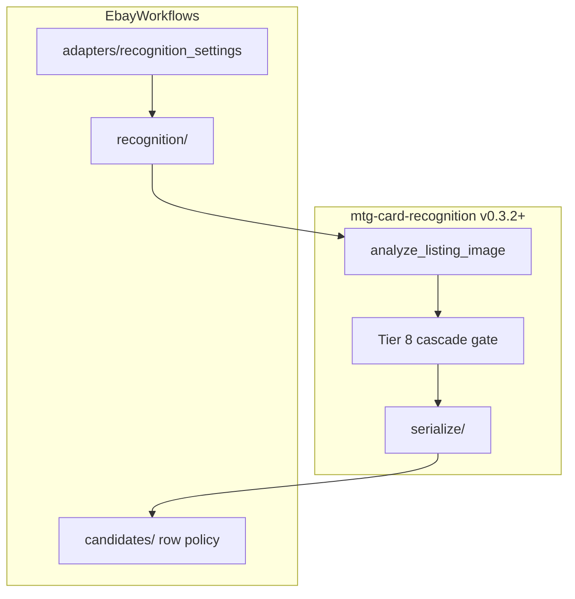

# Integration Specifications

**Status:** API contracts **[Shipped]**; CV/matching detail in `card-recognition-architecture.md`. OCR stack: Tesseract **[Shipped]**, PaddleOCR **[Future]**. Tags: `documentation-status.md`.

## eBay Integration (Phase 1)

## Goal

Retrieve MTG listings and image URLs using eBay APIs with predictable pagination and deduplication.

## Required Inputs

- API credentials (environment variables)
- search query config (keywords, category, condition filters, price bounds)
- pagination and rate-limit settings

## Expected Fields

- listing identifier
- title and URL
- current price and shipping
- condition/seller information if exposed
- primary and additional image URLs
- raw payload capture

## Behavior Requirements

- enforce rate-limit aware request pacing
- retry transient HTTP failures
- record request/response metadata for traceability
- deduplicate by stable external listing ID
- respect eBay Browse **offset ceiling (~10,000 results per query)**; paginate with `EBAY_PAGE_SIZE` and `EBAY_MAX_PAGES_PER_RUN`
- stop pagination when API `total` is reached or `itemSummaries` is empty

## Scryfall Integration (Phase 2)

## Goal

Map listing candidates to canonical MTG card entities.

## Data Strategy

- use Scryfall bulk data snapshot for deterministic local matching
- optionally use card API endpoints for targeted refreshes

## Matching Inputs

- normalized title text
- optional OCR title, set code, collector number

## Matching Outputs

- best candidate `scryfall_id`
- ranked alternatives
- similarity and confidence components

## Cardmarket Integration (Phase 3)

## Goal

Attach market pricing suitable for EV calculations.

## Behavior Requirements

- ingest pricing from downloaded Cardmarket bulk data files (no direct API dependency)
- normalize currencies to configured base currency
- attach price timestamps and source metadata
- preserve condition/language qualifiers where available
- handle missing/stale data explicitly

## Cross-Integration Concerns

- centralized HTTP client with retries, timeout, and backoff
- strict schema validation for external payload parsing
- no secrets in source control or logs
- track connector versioning for reproducibility

## Rate-Limit and Permission Policy

- use token-bucket or leaky-bucket limiting per provider plus a global cap
- honor provider headers (for example `Retry-After`) before retrying
- do not exceed published quotas even if local limit configuration is higher
- allow requests only to documented and authorized endpoints
- map credentials to least-privilege scopes required for eBay and any other live APIs
- block execution when policy checks fail or endpoint access is not explicitly allowed

## Cardmarket Bulk Data Policy

- obtain files only from permitted Cardmarket export/download channels
- record file source, download timestamp, and checksum for provenance
- do not assume API credential availability for Cardmarket pricing
- validate schema and reject malformed bulk files before price joins

## CV/OCR/Matching Components (Phases 5–6) **[Shipped]**

Architecture: **`card-recognition-architecture.md`**, [`mtg-card-recognition/docs/integration/ebay-workflows.md`](../mtg-card-recognition/docs/integration/ebay-workflows.md).

- **Image cascade:** `mtg-card-recognition` — only imported from `recognition/` + `adapters/`
- **Row policy:** `candidates/` — `candidate_sync`, `candidate_gate`, `candidate_selection`, `image_evidence` facade
- **Persistence views:** `recognition/cascade_persist.cascade_regions_from_analysis`
- Local dev: `scripts/install-dev.ps1` (editable sibling)

**Historical [Historical]:** `pipeline/ebay_compat.RegionAnalysis`; in-library `mtg_card_recognition.evidence` gate/attach — removed in library v0.3.2.

### Verification policy **[Shipped]** (two layers)

| Layer | Owner |
|-------|--------|
| Proposal `gate_status` | Library Tier 8 cascade gate |
| `image_verified` / `pricing_eligible` on DB rows | EbayWorkflows `candidates/` |

- **Hard verify:** bottom set + collector **and** (name OCR ≥ `VERIFY_NAME_HARD_MIN` **or** symbol ≥ `VERIFY_SYMBOL_STRONG_MIN`)
- **Strong symbol verify:** symbol + name ≥ `VERIFY_NAME_STRONG_MIN` + bottom set agrees
- OCR, FAISS, mana **never alone** set `image_verified`
- At most **one verified printing per listing** (`apply_per_listing_verification_gates` in `candidate_selection`)
- Provenance: `verification_listing_image_id`, `verification_detection_id`, `verification_region_path`

Optional **`FAISS_PROPOSE_CANDIDATES=true`** inserts a `faiss_proposal` candidate when FAISS top-1 is absent from Phase 2 title matches; strict gate still required for pricing.

### Recommended Libraries

| Library | Role | Status |
|---------|------|--------|
| `opencv-python` | Preprocessing, card crop, zone strips | **[Shipped]** |
| `open-clip-torch` | Image embedding generation | **[Shipped]** |
| `faiss-cpu` / `faiss-gpu` | Nearest-neighbor candidate retrieval | **[Shipped]** |
| `pytesseract` / Tesseract | Zone OCR (name, bottom strip) | **[Shipped]** |
| `paddleocr` | Alternative OCR backend | **[Future]** |
| `rapidfuzz` | Title/set reconciliation | **[Shipped]** |

### Functional Requirements **[Shipped]**

- Persist embedding model version and FAISS index version per match.
- Store OCR engine/version and field-level confidence in `ocr_results` / `evidence_json`.
- Keep top-K candidate list before final disambiguation (Phase 2 + optional FAISS proposal).
- Hybrid final scoring (embedding + OCR + text + price freshness) with `select_pricing_candidate` for singles EV.
- Phase 3 price join runs **after** Phase 5 so newly verified candidates receive Cardmarket prices.

