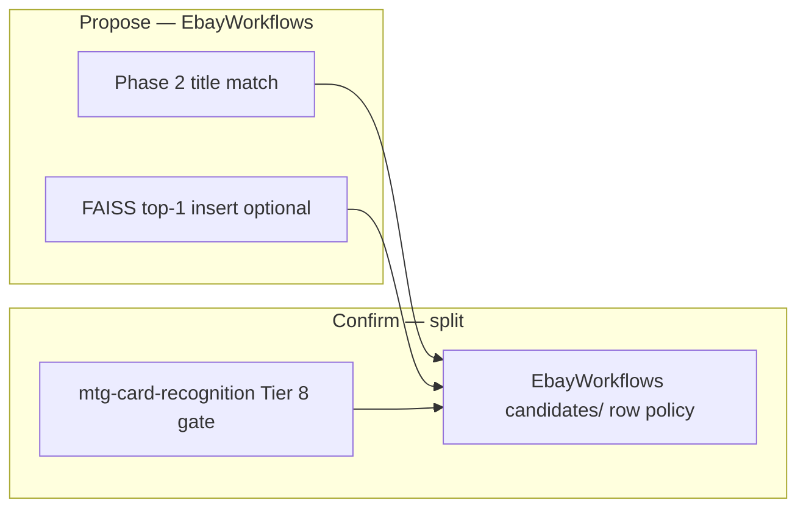

# Recommended Library Stack

## Decision Summary

Production matching is a **hybrid propose-then-confirm** pipeline.

- **Library detail:** [`mtg-card-recognition/docs/architecture.md`](../mtg-card-recognition/docs/architecture.md), [`integration/ebay-workflows.md`](../mtg-card-recognition/docs/integration/ebay-workflows.md)
- **Consumer wiring:** `card-recognition-architecture.md`, `architecture.md`



- **Propose [Shipped]:** Phase 2 title match (`recognition/title_match`); optional FAISS top-1 insert (`FAISS_PROPOSE_CANDIDATES`)
- **Confirm [Shipped]:** Library **Tier 8 cascade gate** on proposals; EbayWorkflows **`candidates/`** (`candidate_gate`, `candidate_selection`) on persisted rows — zone OCR + set/collector + symbol per **printing**

**Historical [Historical]:** single package `mtg_card_recognition.evidence` owned both cascade and row policy — removed in library v0.3.2.

## Core dependencies

- `OpenCV` — preprocessing, regions, alignment, zone crops (library)
- `OpenCLIP` + `FAISS` — art-zone embeddings (~110k vectors full build)
- `Tesseract` — zone OCR **[Shipped]**; `PaddleOCR` **[Future]**
- `RapidFuzz` — title reconciliation (EbayWorkflows Phase 2)

## Implementation pattern (current)

1. Detect regions, align, extract zones (`mtg_card_recognition` pipeline)
2. Run cascade Tiers 0–8; Tier 8 sets proposal `gate_status`
3. `cascade_regions_from_analysis` projects signals for persistence
4. `candidate_sync` merges proposals + `zone_evidence` onto ORM rows
5. `candidates_for_region_evidence` prevents reprint OCR bleed
6. `apply_per_listing_verification_gates` sets ≤1 `image_verified` per listing
7. Phase 3 prices `pricing_eligible` candidates; Phase 4 hybrid rank

Only `recognition/` and `adapters/` import the library — see `adr/0002-package-restructure.md`.

## Library version pin **[Shipped]**

Production installs pin the sibling library in `pyproject.toml`:

```text
mtg-card-recognition @ git+https://github.com/Will-Thain/mtg-card-recognition.git@8ada82b
```

Local development: `scripts/install-dev.ps1` (editable clone of `../mtg-card-recognition`). After bumping the pin, re-run `pytest -q` and Phase 5 sample smoke (`scripts/run_sample_iterations.py`).

## Recommended defaults

- **Preprocessing:** `opencv-python`
- **OCR:** `pytesseract` via library; `paddleocr` **[Future]**
- **Embeddings:** `open-clip-torch` `ViT-B-32` + `force_quick_gelu=True`
- **Vector index:** `faiss-cpu`; full corpus via `build-faiss-full.ps1`
- **Fuzzy text:** `rapidfuzz` (consumer Phase 2)
- **Phase 6 bulk:** OpenCV multi-card + per-crop `run_region_from_image`

## External references

Design references only — see table in prior version; evaluation via Milo NPZ on existing zone crops (`card-recognition-architecture.md` rebuild matrix).

## Operational guidance

- Version embedder + `index_crop_mode` in FAISS meta JSON
- Run `validate-env` after index or recognition config changes
- Labeled crops: `mtg-card-recognition/tests/fixtures/labeled_crops/`
- Prefer deterministic zone confirmation over opaque score drift

## Desktop GUI

- **UI:** PySide6 — subprocess CLI only; no torch/OCR in GUI process
- **Scheduling:** in-app `apscheduler`; headless `run-due-schedules`
- See `gui-application.md`
