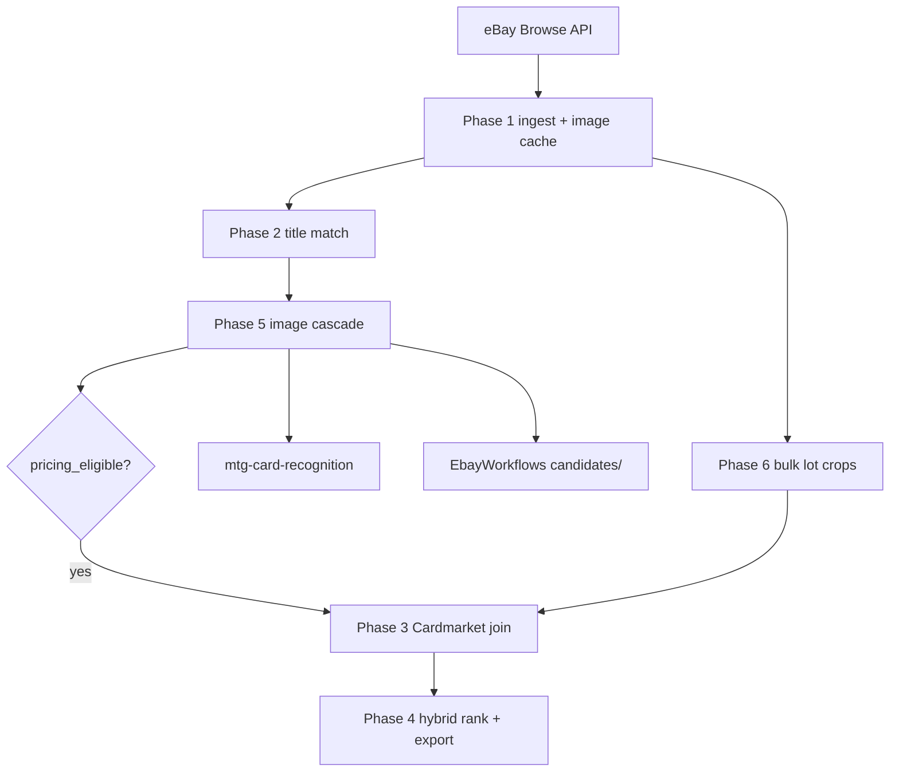

# Workflow Phases

This document defines the first six workflow phases and expected behavior.

## End-to-End Flow



Narrative: eBay listings → cache images → title candidates → **library cascade** + **consumer row policy** → price eligible candidates → rank.

## Phase 1: eBay Search + Image Download + Local DB

### Inputs

- search queries (keywords/category/filter set)
- run window and pagination options

### Outputs

- persisted listing records
- persisted image records + local cache references
- run-level audit and step status

### Acceptance Criteria

- listings are deduplicated on stable listing ID
- images are stored/cached with content hash when available
- failures are retried and recorded without crashing full run

## Phase 2: Title-Based Scryfall Matching

### Inputs

- listing title
- optional subtitle/description fields (if available)
- Scryfall card/bulk reference dataset

### Outputs

- candidate card matches with normalized name score
- best-match card ID and confidence baseline

### Acceptance Criteria

- matching is deterministic for identical input datasets
- ambiguous cases retain top-N candidates for later reconciliation

## Phase 3: Cardmarket Price Join

### Inputs

- matched card identifiers
- Cardmarket pricing dataset/API response

### Outputs

- normalized price fields (currency, timestamp, condition if available)
- price-source provenance metadata

### Acceptance Criteria

- each joined price record indicates source currency and conversion method
- stale/missing prices flagged instead of silently defaulting

## Phase 4: Simple EV Ranking

### Inputs

- listing total cost (price + shipping + optional fees)
- joined market prices
- match confidence indicators

### Outputs

- per-listing EV estimate
- ranking table by EV and confidence-adjusted EV

### Acceptance Criteria

- ranking supports deterministic tie-break rules
- formulas are documented and versioned

## Phase 5: OCR/Image Recognition Verification

### Inputs

- cached listing images
- detected card regions/crops

### Outputs

- OCR text candidates (title, set code, collector number)
- OpenCLIP + FAISS image candidates for each card crop
- image-derived evidence merged via cascade sync (does not override title-only rows without strict verification)

### Acceptance Criteria

- OCR evidence is linked to image and region coordinates
- embedding candidates are persisted with model/index version metadata
- confidence model is updated using OCR corroboration/contradiction

## Phase 6: Bulk-Lot Multi-Card Detection

### Inputs

- lot listing images containing multiple cards

### Outputs

- set of detected card entities per listing image
- aggregated lot EV estimate across detected cards

### Acceptance Criteria

- multi-card detections are represented individually and aggregately
- detector model version and per-region confidence are persisted
- false-positive controls are applied before EV amplification

## Cross-Phase Rules

- every phase writes step-level status (`pending`, `running`, `succeeded`, `failed`)
- every derived field stores provenance and algorithm/model version
- reruns can start at phase boundaries without corrupting prior outputs

## Recommended Execution Order

Phases are numbered 1–6 for historical reasons, but **production scripts run them in this order**:

```
Phase 1 → Phase 2 → Phase 5 → Phase 3 → Phase 6 → Phase 4
```

| Step | Why |
|------|-----|
| Phase 2 before 5 | Title candidates must exist before image verification (except bulk lots, which skip Phase 2) |
| Phase 5 before 3 | Image evidence gate sets `image_verified` and `pricing_eligible` before Cardmarket join |
| Phase 6 before 4 | Bulk lot scores (`v2_lot`) must exist before hybrid singles ranking |
| Phase 4 last | Ranking consumes verified prices from Phase 3 and lot totals from Phase 6 |

Use `./scripts/reanalyze-matching.ps1`, `./scripts/rerun-image-matching.ps1`, or `./scripts/run-large-ingest.ps1` — they follow this order.

## Phase 5: Image Evidence Types

See `card-recognition-architecture.md` for zone layout, Phase 5 sequence diagram, and library contract.

### Wiring **[Shipped]**

1. `recognition/catalog_index` — Phase 2 ORM rows → `CatalogIndex`
2. `recognition/phase5_analysis` — `analyze_listing_image`
3. `recognition/cascade_persist.cascade_regions_from_analysis` — no legacy `RegionAnalysis`
4. `candidates/candidate_sync` + `candidate_attach` — merge proposals onto rows
5. `candidates/candidate_selection.apply_per_listing_verification_gates`

### Verification gate **[Shipped]**

| Layer | Module |
|-------|--------|
| Tier 8 on proposals | mtg-card-recognition `cascade/gate.py` |
| Row policy | EbayWorkflows `candidate_gate` + `candidate_selection` |

- **Hard verify:** bottom **set + collector** **and** (name OCR ≥ `VERIFY_NAME_HARD_MIN` **or** symbol ≥ `VERIFY_SYMBOL_STRONG_MIN`)
- **Strong symbol verify:** symbol + name ≥ `VERIFY_NAME_STRONG_MIN` + bottom set agrees
- **Lot crops (Phase 6):** `set_collector` with parsed identifiers

OCR, FAISS, and mana **alone never verify**. At most **one candidate per listing** verified for pricing/EV. Region attach uses `candidates_for_region_evidence`.

Optional: `FAISS_PROPOSE_CANDIDATES=true` inserts `faiss_proposal` when FAISS top-1 ∉ Phase 2 matches.

**Historical [Historical]:** in-library `mtg_card_recognition.evidence`; OR-gate on any single signal.

Full spec: `card-recognition-architecture.md`.

### FAISS index

Vectors should be built with **`FAISS_INDEX_USE_ART_ZONE=true`** (default) so embeddings match art-zone query crops. Full corpus: `./scripts/build-faiss-full.ps1` or `rebuild-faiss-and-reanalyze.ps1`. Rebuild only when crop mode, embedder model, or dimension changes — not for documentation or OCR backend swaps.

## Phase 6: Bulk Lot Pricing

Bulk listing titles are blocked from **title-only** Cardmarket pricing (`bulk_lot_title_requires_image_evidence`). Phase 6 prices individual lot crops when **crop-level** evidence passes strict rules (primarily `set_collector` or verified set symbol) via `crop_match_allowed_for_pricing` — FAISS and mana alone do not verify.

